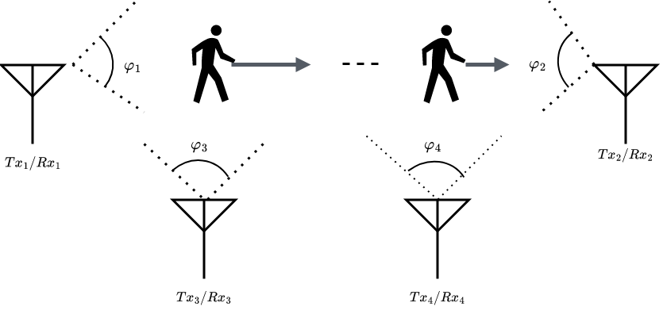

<div align="center">
  
# Human Detection Based on Learning and Classification of Radio Scattering Parameters and Para-Hermitian Eigenvalue Decomposition

Frank E. Ebong, [Nicola Novello](https://scholar.google.com/citations?user=4PPM0GkAAAAJ&hl=it), [Andrea M. Tonello](https://scholar.google.com/citations?user=qBiseEsAAAAJ&hl=it)

</div>

Official repository of the paper "Human Detection Based on Learning and Classification of Radio Scattering Parameters and Para-Hermitian Eigenvalue Decomposition" published at IEEE International Symposium on Personal, Indoor and Mobile Radio Communications (PIMRC) 2024. 

> Algorithm for human detection based on a novel technique for pre-processing the scattering parameters and on a recently proposed new objective function for classification.

---

# 📷 Scenario

<div align="center">

</div>

---

# 💻 How to run the code

## Matlab part

Assume to have collected the S-parameters using a four-port Vector Network Analyzer (VNA). To pre-process the data using the Para Hermitian Eigenvalue Decomposition method, follow [these instructions](https://github.com/nicolaNovello/S-PBHD/tree/main/MatlabPreProcessing). 

## Python part

The directory where the scripts are must contain an additional folder `Datasets` containing 3 folders: `Lambdas`, `Cauchy`, and `Raw`. `Lambdas` and `Cauchy` contain the `.mat` files for the datasets of 0,1, and 2 people obtained using the corresponding pre-processing algorithms. `Raw` contains 3 folders (one for each class): `Empty`, `Person`, and `Two_People` that contain the `s4p` files obtained from the Matlab part. 

The file `main.py` runs the experiments. 
```
python3 main.py --mode Lambdas 
```
Where "mode" identifies the pre-processing algorithm used, which can be: Lambdas, Cauchy, No. 
  
The files `main_functions.py`, `classes.py`, and `utils.py` comprise the needed methods and classes. 

---

## 📝 References

If you use this code for your research, please cite our paper (coming soon):
```

```
---

## 📋 Acknowledgments
The implementation is based on / inspired by:

- [https://github.com/nicolaNovello/discriminative-classification-fDiv](https://github.com/nicolaNovello/discriminative-classification-fDiv)

---

## 📧 Contact

[nicola.novello@aau.at](nicola.novello@aau.at)

[frank.ebong@aau.at](frank.ebong@aau.at)

